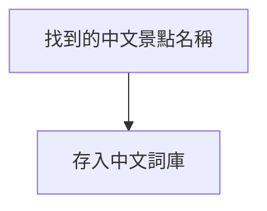
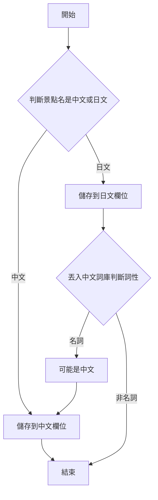



Funliday 使用 Elasticsearch (以下簡稱 ES) 做為搜尋引擎的基礎設施，今天來分享一下 Funliday 最近的搜尋功能做了哪些最佳化。

大家都知道日文其實包括了漢字及假名，所以同樣是輸入「台北」，實在很難了解到底是在搜尋中文的「台北」還是日文的「台北」。這時候就來**簡單**的講一下 ES 的搜尋原理，在將文字儲存進 ES 裡面前，ES 會用 analyzer 將文字拆解後再存入 ES。

隨便舉個例子，要將「行天宮捷運站」用英文 (english) 的 analyzer 儲存進 ES 的話，會變成`「行、天、宮、捷、運、站」`，如果是用中文 (jieba_index) 的 analyzer 儲存進 ES 的話，則會變成`「行天、行天宮、天宮、捷運、捷運站、運站」`，所以選對 analyzer 是非常重要的一件事。中文跟英文可以用正規表示式來判斷到底是哪種語言，**但要用程式分辨中日文真的沒有這麼容易**。所以 Funliday 改用其他方式來解決這個問題。

---

Funliday 無時無刻都在找尋世界上各個景點，並將內容儲存起來。如果這個景點名稱是中文的話，Funliday 會將景點名稱儲存至詞庫裡面。

然後將 ES 裡面所有的景點全部再重跑一次 index (將資料儲存至 ES 裡面)。在重跑 index 前，Funliday 會用一些 NLP 的技術來判斷原本在 ES 裡面的景點是中文或日文。如果是日文的話，我們會再丟入中文詞庫裡面判斷詞性，如果是名詞的話，我們就會把這個景點名稱也認定為是中文。

舉個例子，假設有一間在日本的拉麵店叫做「神鳥拉麵」，而且 NLP 判斷為這四個字是日文的話，就可以丟入中文詞庫取出詞性，如果是名詞的話，可以將「神鳥拉麵」也視為中文。這時我們如果分別用中日文的 analyzer 來看看結果，會發現日文 (kuromoji) 是`「神、鳥、拉、麵」`，而中文 (jieba_index) 是`「神鳥、拉麵」`。到時候在搜尋時輸入「拉麵」的話，如果在 index 階段沒有判斷詞性的這個步驟，是有可能會搜不到這間拉麵店的喔，不過搜尋的細節等下一篇再來分享吧。

要能讓搜尋體驗變得更好，ES 的 analyzer 真的要好好研究才行。

* [All About Analyzers, Part One](https://www.elastic.co/blog/found-text-analysis-part-1)
* [Text Analysis](https://www.elastic.co/guide/en/elasticsearch/reference/current/analysis.html)
* [Q: How can I recognize from the 32 bit value of a Unicode character if this is a Chinese, Korean or Japanese character?](https://www.unicode.org/faq/han_cjk.html#4)
* [结巴中文分词](https://github.com/fxsjy/jieba)