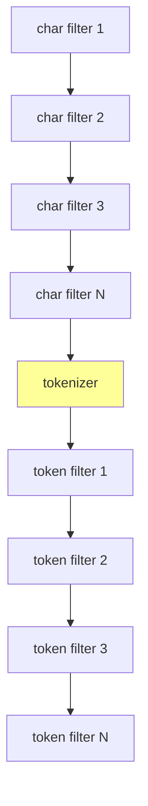
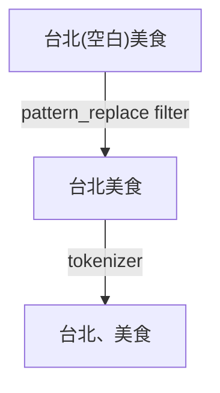
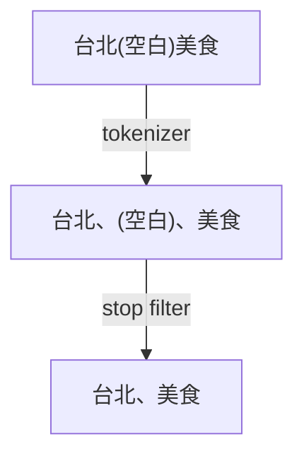



續上篇，其實在 highlight 功能上線後，給我們設計師測試，一開始測都沒問題，但後來測到「台北 美食」就出現狀況了，發現出來一堆無關的內容 (如圖的第一個結果)，而且畫面上也沒有任何 highlight，這實在太怪了，所以今天就來分享一下我們怎麼解決這個問題。

這篇不會提到日文，但相同邏輯也可以套用在日文斷詞喔。進入正題，我們用了中文斷詞 (jieba_index)，會發現「台北 美食」被斷成了「台北、(空白)、美食」，而其他被搜尋的內容，只要有參雜 (空白) 的內容，也因為比對成功所以被搜尋出來了。而 highlight 也因為 (空白) 無法上色，所以當然沒有紅色標示啦。

後來才發現，其實是因為 jieba 只負責斷詞，至於文字裡面是否有包含標點符號、(空白)...等，jieba 完全不在意，所以如果要解決這個問題，必須要從 ES 本身著手。



其實 ES 提供了很多的 filter 與 tokenizer 做結合，結合起來才叫做 analyzer，而在 tokenize 之前所執行的是 char filter，在 tokenize 之後執行的叫做 token filter，所以我們可以利用這些 filter 將標點符號跟 (空白) 過濾掉。

## 使用 pattern_replace filter



我們第一版採用的是 char filter 裡面的 `pattern_replace` filter，顧名思義這個 filter 就是把文字做替換，以我們的需求來說，就是要把標點符號跟 (空白) 轉成空字串，所以可以寫成下面這個樣子。

```js
const settings = {
  analysis: {
    char_filter: {
      jieba_char_filter: {
        type: 'pattern_replace',
        pattern: '[\\t\\s!$%^&*()\\[\\]{}<>|:;\\\\\'",.?/˙‥‧‵、。﹐﹒﹔﹕！＃＄％＆＊，．：；？＠～•…·¡¿¦¨¯´·¸º‽‼⁏※†‡ˉ˘⁇⁈⁉ˆ⁊⸘]',
        replacement: ''
      }
    },
    analyzer: {
      jieba_search_normalize: {
        char_filter: ['jieba_char_filter'],
        tokenizer: 'jieba_search'
      }
    }
  }
}
```

但後來看了幾篇文章後，發現 `pattern_replace` filter 用在這裡會有點怪，它是拿來用在像 emoji 轉成文字、特定的正規表示式轉換...等，所以也要注意正規表示式沒寫好的話，其實很容易造成效能瓶頸，所以要慎用。



## 使用 stop filter

後來發現其實應該要用 token filter 來處理才對，把經過 tokenizer 處理完的 token stream 再做二次處理，而這裡就要用到 token filter 裡面一拖拉庫 filter 的其中一個 `stop` filter。

`stop` filter 的功能是將 token stream 裡面屬於 stop word (停用詞) 的 token 移除，對於英文來說，停用詞就是「this、that、the、a、on」這類單字；而中文來說其實就是「的、啊」這類字，當然也可以將標點符號及 (空白) 加上去。所以改用 `stop` filter 之後，就寫成下面這個樣子。

```js
const settings = {
  analysis: {
    analyzer: {
      jieba_search_normalize: {
        tokenizer: 'jieba_search',
        filter: ['jieba_stop', 'whitespace_stop']
      }
    },
    filter: {
      jieba_stop: {
        type: 'stop',
        stopwords_path: 'stopwords/stopwords.txt'
      },
      whitespace_stop: {
        type: 'stop',
        stopwords: [' ', '　'] // 前面是半型空白，後面是全型空白
      }
    }
  }
}
```

大家可能發現到為什麼會有兩個 `stop` filter，我們在測試的時候，發現 (空白) 似乎沒辦法用檔案的型式 (`stopwords_path`) 讀取，所以直接寫死在 `stopwords` 陣列，這樣就可以了。

---

從 `pattern_replace` filter 改成 `stop` filter 之後的結果一樣，但意義不太一樣。而且 ES 在搜尋時好像還可以對 stop word 做一些額外的處理，但這是後話，目前也還沒研究到那裡，有機會再來分享吧。

---

工商服務，我們在徵後端工程師啦！如果你對於開發景點資料庫 (PostgreSQL)、關鍵字搜尋 (Elasticsearch)、機器學習有興趣的話，歡迎 FB 私訊粉絲頁或直接寄信到 kewang@funliday.com 喔！

* [如何最佳化中日文的關鍵字搜尋 - 2](https://techblog.funliday.com/2021/06/12/%E5%A6%82%E4%BD%95%E6%9C%80%E4%BD%B3%E5%8C%96%E4%B8%AD%E6%97%A5%E6%96%87%E7%9A%84%E9%97%9C%E9%8D%B5%E5%AD%97%E6%90%9C%E5%B0%8B-2/)
* [Anatomy of an analyzer | Elasticsearch Guide [7.13] | Elastic](https://www.elastic.co/guide/en/elasticsearch/reference/current/analyzer-anatomy.html)
* [Pattern replace character filter | Elasticsearch Guide [7.13] | Elastic](https://www.elastic.co/guide/en/elasticsearch/reference/current/analysis-pattern-replace-charfilter.html)
* [停用詞 - 維基百科，自由的百科全書](https://zh.wikipedia.org/wiki/%E5%81%9C%E7%94%A8%E8%AF%8D)
* [Stop token filter | Elasticsearch Guide [7.13] | Elastic](https://www.elastic.co/guide/en/elasticsearch/reference/current/analysis-stop-tokenfilter.html)