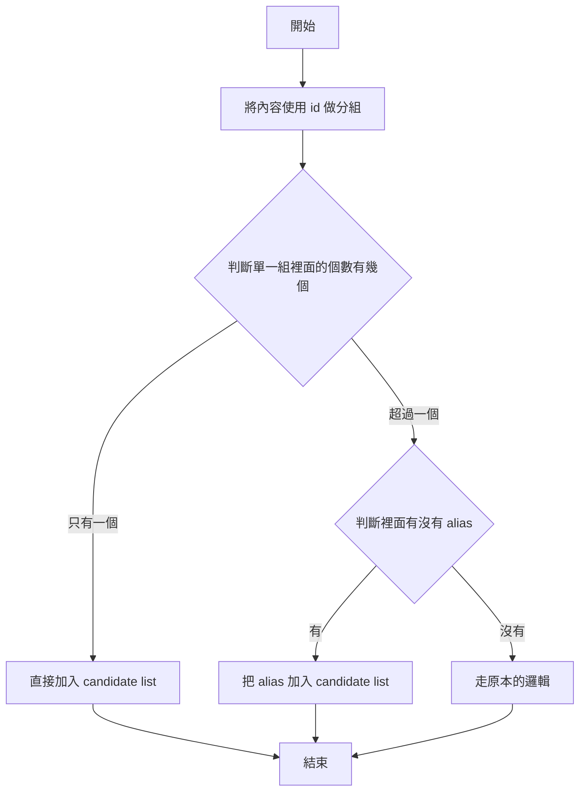



最近一直在改 autocomplete，對於使用者的體驗應該有蠻明顯的提升，所以繼兩年半後，來發第四篇關於 autocomplete 的文章。

## 1. 照使用次數排序

在 autocomplete 功能上線的第一天，排序一直以來是用字典排序，但如果有熱度排行的話，這樣子對使用者會更友善。而 Funliday 本來就有記錄了每次使用者選取了哪個 city，這樣子我們就可以用這些資料來做 city 的熱度排序。

所以當使用者輸入「中山區」的時候，就有可能會是「基隆中山區」跟「台北中山區」互爭第一，而不是一直固定的順序。當然，這個的實作方式前提就是要把熱度存進 metadata 裡面才行，這個部分可以參考第二篇的內容喔。

---

## 2. 加上別名 (alias)

直接舉例，很少人會打「我要去板橋區逛夜市」，應該都是打「我要去板橋逛夜市」吧？在 Funliday 裡面，資料庫存的都是官方名稱「板橋區」、「花蓮縣」，但使用者一般不會直接打全名，能讓使用者少輸入就儘量少輸入，所以有了 alias 這個機制的產生。

```
板
板橋
板橋山*123457
板橋區*123456
```

照原本的邏輯來看，如果輸入「板橋」的時候，candidate 會照順序顯示「板橋山」、「板橋區」，這也是之前提到的 Sorted Set。但加了 alias 的邏輯之後，則會照順序顯示為「板橋」、「板橋山」，儲存方式會變下面這樣：

```
板
板橋
板橋*123456
板橋山*123457
板橋區*123456
```

**使用者對於板橋到底是「市」還是「區」根本不在意**，所以需要有個 alias 可以顯示出來，邏輯會變這樣：



改用上面這種邏輯之後，使用者只要輸入「板橋」就能避免像是「板橋山」會在「板橋區」前面顯示的問題，也可以讓使用者少輸入一些字就能在第一筆找到他要的內容了。

---

## 3. 照目前國家排序

其實相同城市名的狀況在許多國家都有出現，以台日舉例，台灣有三重區、松山區、台東市，日本有三重縣、松山市、台東區。Funliday 是全球化的服務，如果照字典排序的話，至少會有一個國家的使用者不滿意，所以為了解決這個問題，我們拿了使用者的「所在國家」來做應用。

若使用者同意使用定位功能的話，我們就會把所在國家的城市排序在前面，這是因為我們認為**使用者對於自己國家的城市名比較有親切感**，如果其他國家的相同城市名顯示在最上面，可能會有點困惑。

---

## 4. 將全球百大城市往前排

跟上一點的問題一樣，因為全世界同名的城市實在太多了，在實作時我們發現光是 San Francisco 就有超過十個 (包括義大利、巴拉圭、阿根廷、瓜地馬拉...)，而廣為人知是美國的舊金山，於是我們想到或許將全球百大城市排序往前排是一個不錯的方式。

相同情況也發生在 Paris，有美國、英國、加拿大，但大家應該對法國的比較熟悉。而這個功能的實作方式就是先定義好哪些是百大城市，然後直接放在 autocomplete 的 metadata 裡面，等到取出來之後要排序時，再依照百大城市來排，這樣可以確保百大城市會排在最上面。

不過這樣的實作方式會有一個重大的問題，假設美國的 san francisco 在 Sorted Set 是排在其他國家的後面，像下面這樣子，然後取資料時只取 3 筆，那就無論如何都找不到美國的 san francisco。

```
san francisco*123456
san francisco*226857
san francisco*423896
san francisco*498437 => 美國舊金山
```

雖然目前好像還沒遇到這個問題，不過也已經先想好了解法，就是在使用 ZADD 塞資料到 Redis 的時候，可以將這筆資料的分數提高讓資料可以排在前面，避免無法取得資料。

---

## 5. 調整分隔符號

大家看到這幾篇內容應該都有發現，我們的 autocomplete 格式是 `name*id`，用 `*` 來做為分隔符號。但會遇到下面的這個問題：

```
san francisco*123456
san francisco*226857
san francisco*423896
san francisco*498437 => 美國舊金山
san*45632 => 城市 A
san*67545 => 城市 B
```

如果只輸入 `san` 的話，理論上應該要先顯示最下面兩個 san city 才對，但因為我們用了 `*` 做分隔符號，而 `(空格)` (0x20) 在 ASCII code 裡面是排在 `*` (0x2A) 前面的，所以造成如果只取得四筆資料，這樣子是永遠拿不到理應在最前面的「城市 A」和「城市 B」了。

所以我們只能改分隔符號，想了一下比 `(空格)` 還要更適合，而且字典排序又在它前面的，那應該就是 `(NULL)` (0x00) 了，改用 `(NULL)` 之後，儲存內容會變成下面這樣：

```
san\x0045632 => 城市 A
san\x0067545 => 城市 B
san francisco\x00123456
san francisco\x00226857
san francisco\x00423896
san francisco\x00498437 => 美國舊金山
```

避免歐美語系常用多個單字加上空格結合成一個城市名，但無法找到單名城市名的狀況。而回到 Node.js 的部分，分隔符號既然改成了不可視字元，那我們的程式也要調整成下面這樣子才行：

```js
// BEFORE
const beforeParts = name.split("*");

// AFTER
const afterParts = name.split("\u0000");
```

---

## 6. 加上 parent city

簡單舉個例，畫面上如果顯示成下面這樣，有人看的懂嗎？

```
中山區, 台灣
中山區, 台灣
```

其實這也是一開始設計的時候沒處理好，這樣子真的不知道是「台北市的中山區」，還是「基隆市的中山區」，所以我們最近把 parent city 也加上去了，所以會變成這樣子顯示：

```
中山區, 基隆市, 台灣
中山區, 台北市, 台灣
```

其實我們的許多資料都是從 Open data 來的，但 parent city 這個就不一定全世界都有，所以我們由土法煉鋼的方式。原則上 candidate city 應該會被 parent city 的範圍包住，所以用 PostGIS 的 `ST_Intersects` 來計算全世界的 parent city，這個也跑了好幾天才跑完。

但因為 Open data 的 boundary box 不一定很準確，相對的 parent city 也是有一些錯誤。這段就真的只能透過工人智慧來解決問題了。

---

## 7. 移除連續重複名稱

這個主要是從新加坡的需求而來的，新加坡既是國家，也是城市。但顯示出來就會變成下面這樣：

```
新加坡, 新加坡
```

這樣子真的有點奇怪，所以我們想了一個方式，目前既然有了 `city, parent, country` 這三層的結構，所以如果有任兩個連續一樣名稱的話，就只留一個就好，調整後會變下面這樣子：

```
新加坡
```

這樣使用者應該也比較不容易困惑。

---

洋洋灑灑列了 7 大調整，雖然有些功能還沒上 production，但這樣的修改應該可以讓使用者的體驗有感提升才對！

---

## References

* [用 Redis 來處理 City 的 autocomplete 功能 - 1](https://techblog.funliday.com/2019/01/08/%E7%94%A8-Redis-%E4%BE%86%E8%99%95%E7%90%86-City-%E7%9A%84-autocomplete-%E5%8A%9F%E8%83%BD-1/)
* [用 Redis 來處理 City 的 autocomplete 功能 - 2](https://techblog.funliday.com/2019/01/09/%E7%94%A8-Redis-%E4%BE%86%E8%99%95%E7%90%86-City-%E7%9A%84-autocomplete-%E5%8A%9F%E8%83%BD-2/)
* [ZADD - Redis](https://redis.io/commands/ZADD)
* [城邦 - 維基百科，自由的百科全書](https://zh.wikipedia.org/wiki/%E5%9F%8E%E9%82%A6)